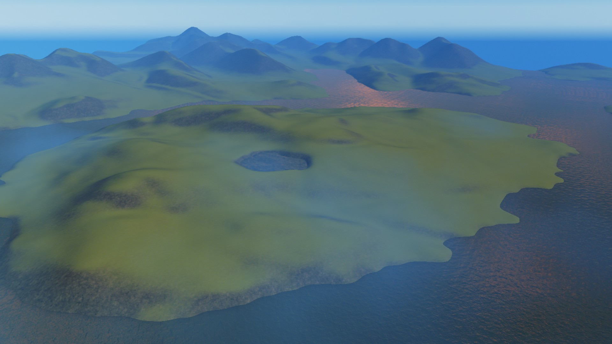

# Cities: Skylines heightmap generator

A Python script to download and convert real-world elevation data for use in the Cities: Skylines map editor.

The source of the data is NASA's SRTM, which provides 90m resolution globally.

Main feature compared to https://terrain.party/ is improved handling of water and negative altitudes. This means islands and polders work out of the box.

Main downside is that it's probably more buggy and harder to use, especially if you don't live on the same side of the world as me.

## Installation

Since Cities: Skylines runs on Windows, you'll probably want to run this under Windows. For the love of god, please use Anaconda, to save yourself a week of dependency hell. Anaconda ships with many scientific libraries such as Numpy, Scipy and Matplotlib and many more are available.

```
pip install requests pyshp pypng
conda install rasterio
```

## Usage

```
python heightmap.py name lat lon
```

Some parameters can be tweaked in the code for now.
